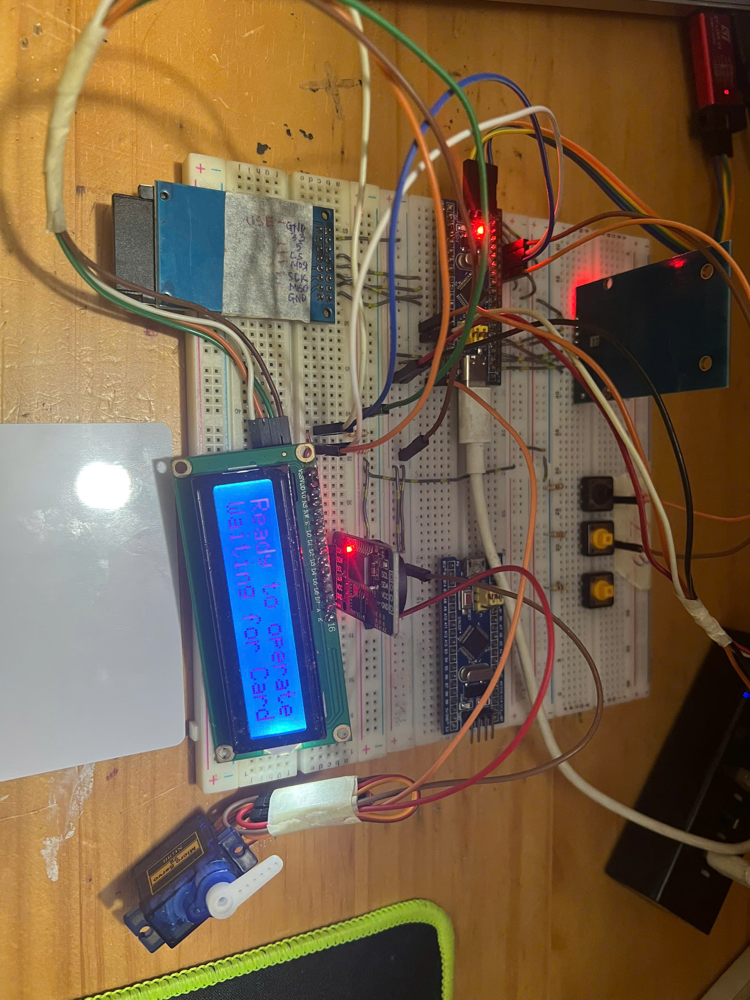
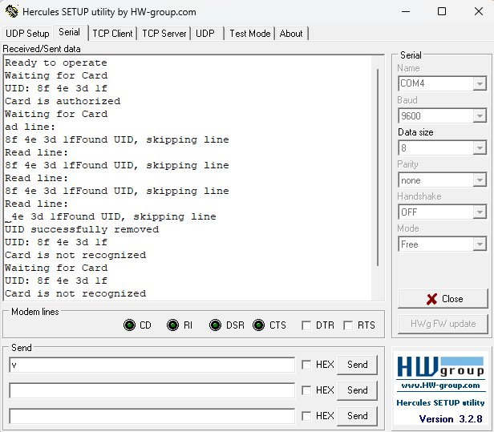

# Vehicle-Management-System

This project involves designing and implementing an Automatic Opening Barrier System for a
parking lot. The system uses an RFID reader to detect and authenticate ID cards, enabling secure
and efficient entry. When a valid card is presented, the barrier opens, and the system logs the
entry details to a micro SD card while displaying information on an LCD screen for easy
monitoring.

**Lcd screen**

    

**Terminal screen**

    

